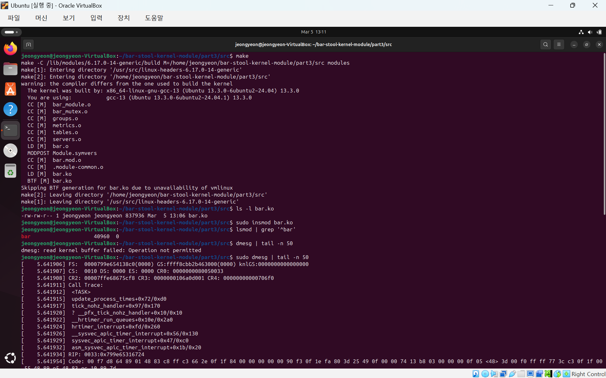
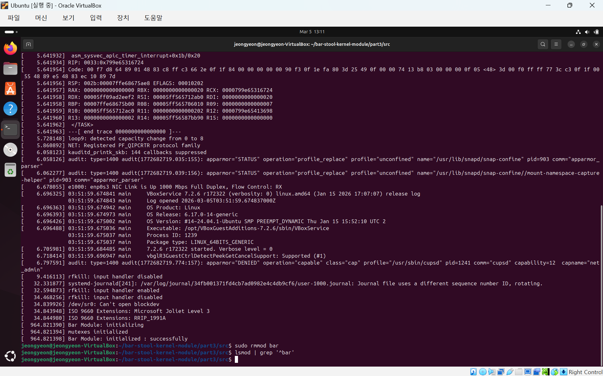

# Linux Kernel Module – Bar Stool Management System

A Linux kernel module project implementing a bar stool management system with mutex-based synchronization and system call interfaces.

Kernel-level simulation of bar stool and table management using a Linux kernel module written in C.  
This project demonstrates system calls, concurrency control, and mutex-based synchronization in an operating system environment.

**Course:** Operating Systems (COP4610) – Florida State University  
**Language:** C  
**Environment:** Linux Kernel Module

## Overview
This project was developed as part of the Operating Systems course at Florida State University.

The goal of the project was to design and implement a Linux kernel module that simulates the management of bar tables and stools. The module demonstrates concepts related to system calls, concurrency, synchronization, and kernel-level resource management.

## Features
- Linux kernel module implementation in C
- System call tracing
- Concurrent resource management
- Mutex-based synchronization
- Simulation of customer seating and server actions

## My Contribution
Contributed to the implementation and testing of the kernel module including:

- Development of group management logic for resource allocation
- Implementation of mutex-based synchronization mechanisms
- Integration and debugging of kernel module components
- Testing and validation of concurrent kernel behavior

## Group Members
- Asia Thomas
- Cristhian Prado
- Jeongyeon Kim

## Project Structure

```
project2/
│
├ README.md
├ build.png
├ dmesg.png
├─ part1
│  ├─ empty.c
│  ├─ empty.trace
│  ├─ part1.c
│  └─ part1.trace
│
├─ part2
│  ├─ my_timer.c
│  └─ Makefile
│
└─ part3
   └─ src
      ├─ bar_module.c
      ├─ bar_module.h
      ├─ bar_mutex.c
      ├─ bar_mutex.h
      ├─ groups.c
      ├─ groups.h
      ├─ metrics.c
      ├─ metrics.h
      ├─ servers.c
      ├─ servers.h
      ├─ tables.c
      ├─ tables.h
      ├─ test_syscalls.c
      └─ Makefile
```

## Technologies
- C
- Linux Kernel Module
- System Calls
- Mutex Synchronization
- Operating Systems Concepts

## Build & Run

Requirements:

- Linux environment
- GCC compiler
- Kernel module build support

Compilation:

```
make
sudo insmod bar.ko
sudo rmmod bar
```

## Kernel Module Execution

### Build and Load

The kernel module was compiled and inserted into the kernel.



### Kernel Logs and Removal

Kernel logs confirm successful initialization, and the module was removed using rmmod.



### Module Removal

The module was removed successfully using `rmmod`.


## Notes
This repository is a fork of the original team project developed during university coursework.
